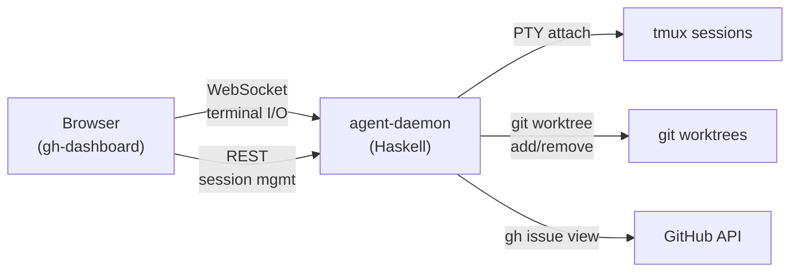
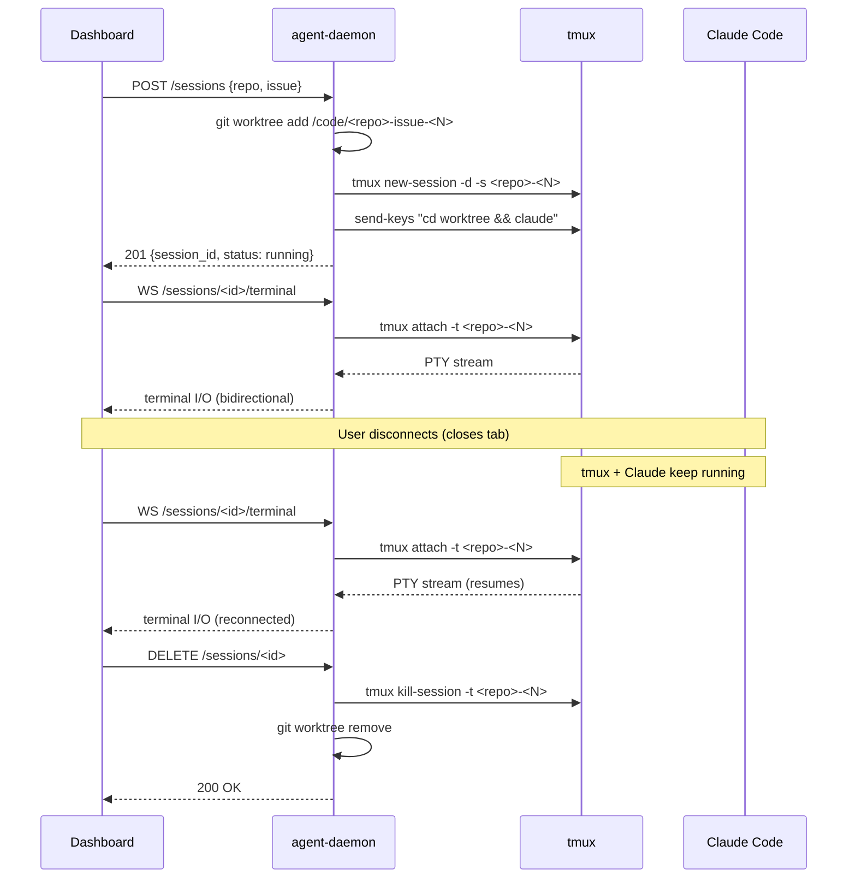
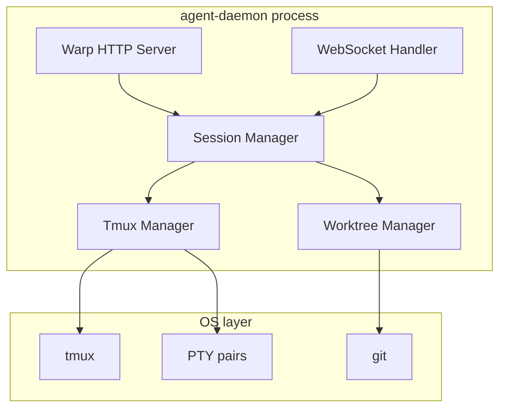
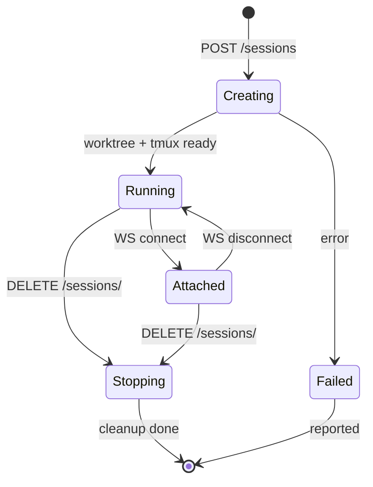
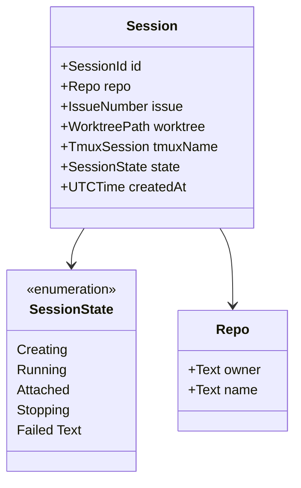
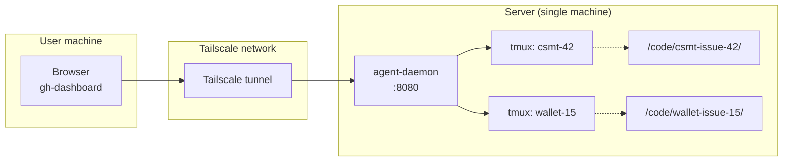

# Agent Daemon — Design

## Overview

A Haskell WebSocket server that manages Claude Code agent sessions.
Runs on a single machine reachable via Tailscale, providing full
terminal access to tmux sessions through xterm.js in the browser.

## System Context



## Session Lifecycle



## Component Architecture



### Components

- **Warp HTTP Server** — REST endpoints for session CRUD
- **WebSocket Handler** — bridges xterm.js to tmux PTY streams
- **Session Manager** — tracks active sessions, maps issue to session
- **Tmux Manager** — creates, attaches, kills tmux sessions
- **Worktree Manager** — creates and removes git worktrees

## Session State Machine



## Data Model



## Naming Conventions

| Entity | Pattern | Example |
|--------|---------|---------|
| Worktree path | `/code/<repo>-issue-<N>/` | `/code/cardano-utxo-csmt-issue-42/` |
| tmux session | `<repo>-<N>` | `cardano-utxo-csmt-42` |
| Branch | `feat/issue-<N>` | `feat/issue-42` |

## REST API

### Launch session

```
POST /sessions
Content-Type: application/json

{
  "repo": { "owner": "cardano-foundation", "name": "cardano-utxo-csmt" },
  "issue": 42
}

→ 201 Created
{
  "id": "cardano-utxo-csmt-42",
  "state": "creating",
  "worktree": "/code/cardano-utxo-csmt-issue-42"
}
```

### List sessions

```
GET /sessions

→ 200 OK
[
  {
    "id": "cardano-utxo-csmt-42",
    "repo": { "owner": "cardano-foundation", "name": "cardano-utxo-csmt" },
    "issue": 42,
    "state": "running",
    "createdAt": "2026-03-13T10:30:00Z"
  }
]
```

### Stop session

```
DELETE /sessions/cardano-utxo-csmt-42?cleanup=true

→ 200 OK
```

### Terminal attach

```
GET /sessions/cardano-utxo-csmt-42/terminal
Upgrade: websocket

↔ bidirectional binary frames (terminal I/O)
```

## Network Topology



## Open Questions

1. **Issue context injection** — how does Claude know what issue to work on?
   Options: prompt file in worktree, `CLAUDE_ISSUE` env var, or rely
   on a bootstrap skill that reads from branch name.

2. **Authentication** — Tailscale ACLs may suffice. Add token auth later
   if needed.

3. **Completion detection** — how to know the agent is done?
   Watch for PR creation via GitHub webhook, or poll.

4. **Resource limits** — max concurrent sessions, memory/CPU guards.

5. **Session recovery** — if daemon restarts, rediscover running tmux
   sessions and reconstruct state.
